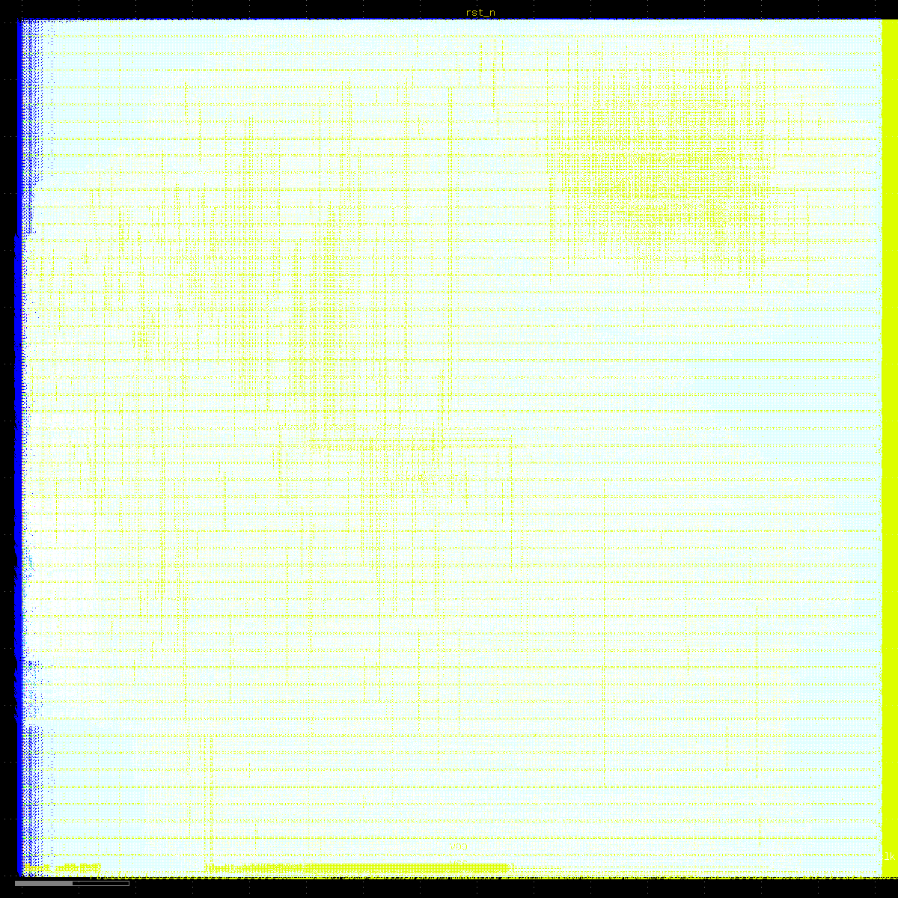

# nano_accel — a chip that runs a nano language model

An INT4 LLM-inference accelerator designed end to end with open-source tools
and verified by running a real model on it. RTL → bit-exact simulation →
synthesis → place & route → GDSII, on the open Nangate 45nm library.



## What it is

- **Accelerator** (`rtl/`): 64 INT4×INT8 MACs/cycle, fused dequant/requant
  drain (`y = clamp(round((acc+bias)·M[c]) >> sh)`), 5-instruction sequencer
  (`SETLEN, GATHER, MATVEC, ARGMAX, HALT`), on-chip token feedback for
  autoregressive decode.
- **The model it serves** (`sw/build.py`): char-level MLP (context 8, embed
  24, hidden 512×2, vocab 128), 425,984 params = 208 KiB INT4, trained with
  numpy on tiny-shakespeare, post-training quantized (per-channel INT4
  weights, INT8 activations). Fully on-chip.
- **Verification** (`tb/tb_nano.sv`): numpy golden integer model mirrors the
  RTL numerics; every generated token compared.

## Results

| | |
|---|---|
| Simulation | **bit-exact, 32/32 tokens**; generated `"tizens:\nWho he we the see the se"` from prompt `"First Ci"` |
| Throughput (sim) | 6,847 cycles/token → **14,604 tok/s @ 100 MHz** |
| Synthesis (Nangate45) | 44,643 standard cells, 0.084 mm² logic, ~0.28 MB SRAM (behavioral, reported separately) |
| Place & route | 183,990 cells, 0.314 mm² design area (56% util) |
| Post-route STA | **setup slack +4.86 ns @ 100 MHz → fmax 194.65 MHz; 0 hold violations** |
| DRC | **0 violations**; KLayout merge clean |
| Power | 143 mW; avg IR drop 1.6 mV |
| GDSII | `pnr/results/nangate45/nano_accel/base/6_final.gds` |

At fmax the same design would sustain ~28,400 tok/s.

## Reproduce

Requirements: `yosys`, `iverilog`, `python3` + `numpy`; Docker for PnR.

```sh
make vectors   # train + quantize the model, emit memory images (out/*.hex)
make sim       # RTL sim: bit-exact check + tokens/s report
make synth     # Yosys synthesis on Nangate45: out/synth_stat.txt
make pnr       # OpenROAD-flow-scripts in Docker: floorplan→route→STA→GDS
```

## Layout

```
rtl/    nano_accel.sv (sequencer+drain), dot64.sv (MAC array), ram.sv (models)
sw/     build.py — train → quantize → compile → golden vectors
tb/     tb_nano.sv — bit-exact check, throughput report
syn/    synth.ys + Nangate45 liberty
pnr/    ORFS config (100 MHz constraint, nangate45), results/ has GDS+reports
out/    generated: hex images, netlist, logs, layout render
```

## Notes

- SRAMs are behavioral (open PDKs ship no SRAM macros) — blackboxed for
  synthesis and reported separately; the PnR run uses depth-capped FF
  placeholder RAMs plus a real host load interface.
- Why the model must fit on-chip: INT4 decode reads all weights per token.
  A 2B-param model at 8,700 tok/s would need ~8.7 TB/s — HBM-class, not
  45 nm. SRAM-resident is the honest regime (same one the Kimi K3 blog post
  used: 0.277 MB SRAM, >8,700 tok/s).
